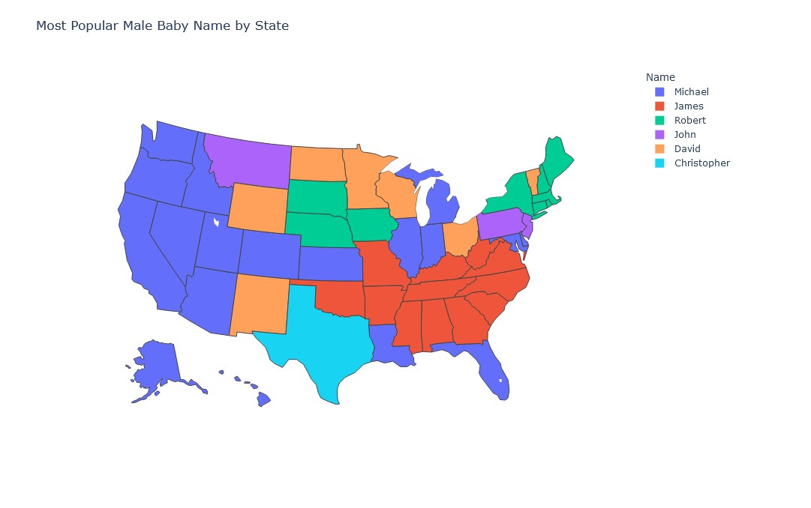
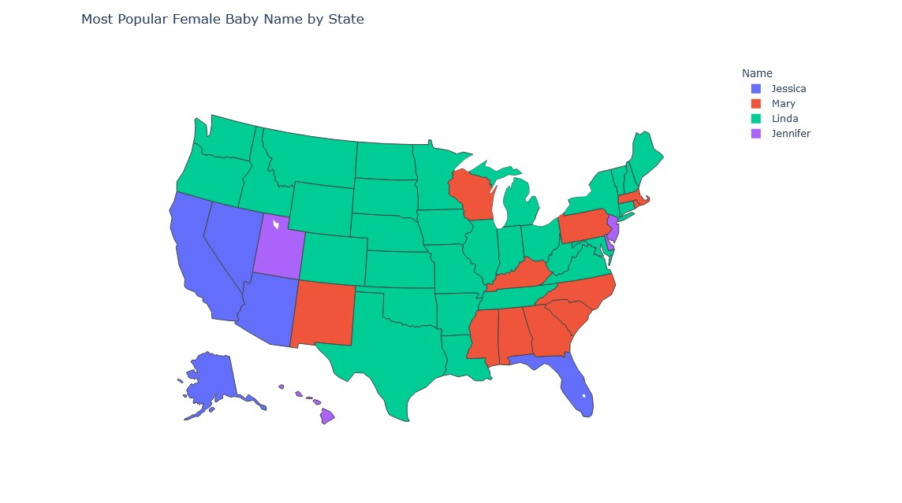

  <h1>US Baby Name Trends</h1>

    
    
    
    
    
    
    
    

# Summary and Conclusion

## Overview:

The dataset of baby names from various states in the US provides a comprehensive view of naming trends over the decades. The data includes columns for the state, gender, year, name, and the count of babies given that name in the corresponding year and state.

## Key Findings:

### Top Baby Names by State:

- Names like Michael, James, John, Robert, and David frequently appeared as the top male baby names in many states.
- For female baby names, Mary, Linda, Jessica, Jennifer, and Emily were commonly popular across different states.

### State-Specific Patterns:

- Each state has unique naming trends influenced by regional and cultural factors. For example, some states might have names with cultural or ethnic significance that are less common nationally.
- The top names for each state often reflect local influences and demographic changes over the decades.

### Gender Differences:

- There are clear distinctions in the naming trends between male and female names. While some names are gender-neutral, the majority are gender-specific, and the trends for male and female names can differ significantly within the same state.

### Popular Names Over Time:

- The visualizations showed that certain names like Michael and Mary had long periods of high popularity, while others like Linda and Jessica had shorter, more intense peaks in popularity.
- The popularity of names can often be tied to cultural events, prominent figures, or trends in media.

## Conclusion:

Over the decades, the analysis of baby names reveals dynamic and evolving trends influenced by cultural, social, and regional factors. The visualizations effectively highlight how certain names rise and fall in popularity, offering insights into broader cultural shifts and societal changes.

By examining these trends, we better understand the cultural dynamics and preferences that shape naming practices in the United States. The findings underscore the impact of regional influences and the significance of gender differences in naming trends.

## Explanation of the Approach and Visualizations:

### Data Cleaning and Preparation:

- Grouping and summing the counts by state, gender, year, and name provided a clear picture of naming trends over time.

### Top Names Identification:

- A ranking system was used to identify the top 5 baby names for each state and gender across different years. This approach allowed for a focused analysis of the most popular names.

### Visualization Techniques:

- Line plots were used to visualize the trends of each state's top 10 baby names over time. This provided a clear visual representation of how the popularity of names changed over the decades.
- Combining the name and gender into a single legend entry ensured that the visualizations were easy to interpret and the legends were meaningful.

### Insights and Interpretation:

- The visualizations and data analysis revealed patterns and trends reflective of broader cultural and societal changes.
- The regional differences in naming trends highlight the diverse cultural influences across different states in the US.

The visualizations and analysis provide a comprehensive understanding of the naming trends, offering valuable insights for researchers, sociologists, and anyone interested in the cultural dynamics of naming practices in the United States.

## License
This project is licensed under the MIT License - see the [LICENSE](LICENSE) file for details.
